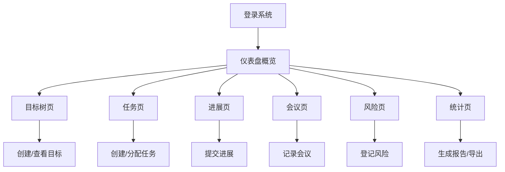

## 1. 产品概述

团队目标管理（OKR）Web 应用，帮助部门负责人和团队成员跟踪季度目标与关键结果，提升团队执行力与目标透明度。

- 解决团队目标不透明、进度难追踪、协作效率低的问题
- 服务于企业部门管理者及团队成员，支撑季度目标制定、执行跟踪、绩效复盘全流程

## 2. 核心功能

### 2.1 用户角色

| 角色 | 登录方式 | 核心权限 |
|------|----------|----------|
| 部门负责人 | 账号登录 | 创建部门目标、分配关键结果、查看全员进度、生成统计报表、归档目标 |
| 团队成员 | 账号登录 | 创建个人目标、更新完成进度、提交进展说明、评论讨论、查看目标对齐 |

### 2.2 功能模块

1. **仪表盘**：目标概览、进度统计、待办事项、近期动态
2. **目标树**：层级化目标展示、目标对齐关系、部门与个人目标视图
3. **任务**：任务列表、任务详情、负责人分配、优先级、截止日期
4. **进展**：进展提交、完成百分比更新、佐证文件上传、评论与提及
5. **会议**：例会纪要、会议记录、行动项跟踪、会议历史
6. **风险**：风险登记、阻塞标记、风险等级、处理状态
7. **统计**：完成率统计、周期对比、周报生成、绩效导出

### 2.3 页面详情

| 页面名称 | 模块名称 | 功能描述 |
|----------|----------|----------|
| 仪表盘 | 概览卡片 | 目标总数、进行中目标、已完成目标、风险数量 |
| 仪表盘 | 进度环形图 | 部门整体目标完成率可视化 |
| 仪表盘 | 待办任务 | 待处理任务列表，快速跳转 |
| 仪表盘 | 近期动态 | 最新进展、评论、风险更新时间线 |
| 目标树 | 目标层级树 | 树形结构展示目标层级关系 |
| 目标树 | 目标对齐视图 | 横向展示个人目标与部门目标的对齐关系 |
| 目标树 | 目标详情侧栏 | 目标描述、权重、周期、负责人、关键结果 |
| 目标树 | 创建目标 | 新建部门/个人目标，设置权重、周期、拆解关键结果 |
| 任务 | 任务看板 | 按状态（待办/进行中/已完成）分列展示 |
| 任务 | 任务列表 | 表格视图，支持筛选、排序、搜索 |
| 任务 | 任务详情 | 任务描述、负责人、优先级、截止日期、关联目标、评论 |
| 任务 | 创建任务 | 新建任务，关联目标和负责人 |
| 进展 | 进展列表 | 按时间倒序展示所有进展更新 |
| 进展 | 进展详情 | 完成百分比、进展说明、佐证文件、评论区 |
| 进展 | 提交进展 | 更新进度、填写说明、上传文件 |
| 进展 | @提及功能 | 评论中@同事，发送通知 |
| 会议 | 会议列表 | 历史会议记录列表 |
| 会议 | 会议详情 | 会议时间、参会人、会议纪要、行动项 |
| 会议 | 创建会议 | 新建会议记录，添加纪要和行动项 |
| 风险 | 风险看板 | 按风险等级和状态分类展示 |
| 风险 | 风险详情 | 风险描述、等级、影响、责任人、处理方案 |
| 风险 | 标记风险 | 新建风险，关联目标，设置等级 |
| 统计 | 完成率趋势 | 折线图展示目标完成率随时间变化 |
| 统计 | 周期对比 | 多周期目标完成情况对比图表 |
| 统计 | 周报生成 | 一键生成本周进展汇总报告 |
| 统计 | 绩效导出 | 导出目标完成数据作为绩效参考 |
| 统计 | 目标归档 | 归档已结束的目标周期 |

## 3. 核心流程

### 3.1 目标制定流程

部门负责人创建季度部门目标 → 拆解为多个关键结果（KR）→ 设置权重和周期 → 分配给团队成员 → 成员认领并创建个人目标对齐部门目标 → 目标生效

### 3.2 进度跟踪流程

成员查看关联目标 → 更新关键结果完成百分比 → 提交进展说明 → 上传佐证文件 → 负责人审核/评论 → 系统自动汇总整体进度

### 3.3 风险管理流程

发现风险/阻塞 → 在风险页登记 → 设置风险等级和影响范围 → 指处理责任人 → 跟踪处理进度 → 风险解决后标记关闭

## 4. 用户界面设计

### 4.1 设计风格

- **主色调**：深邃靛蓝（#1E3A8A）代表专业与信任
- **辅助色**：翡翠绿（#10B981）表示进展与完成，琥珀橙（#F59E0B）表示警告与风险，玫瑰红（#F43F5E）表示阻塞
- **背景**：浅灰渐变（#F8FAFC → #F1F5F9），卡片纯白带微阴影
- **按钮风格**：圆润方形（border-radius: 10px），主按钮实色填充带轻微悬浮上浮动效
- **字体**：标题使用 "Inter SemiBold"，正文使用 "Inter Regular"，数字使用等宽字体增强数据感
- **布局风格**：左侧导航栏 + 顶部标题栏 + 主内容区的经典企业应用布局
- **图标风格**：线性图标，统一 20px 尺寸，颜色跟随主题

### 4.2 页面设计概览

| 页面名称 | 模块名称 | UI 元素 |
|----------|----------|---------|
| 仪表盘 | 概览卡片 | 四列网格卡片，左侧图标，右侧数据 + 趋势箭头 |
| 仪表盘 | 环形进度图 | 大尺寸环形图，中心显示百分比，带动画效果 |
| 仪表盘 | 动态时间线 | 左侧竖线，右侧事件卡片，时间戳显示 |
| 目标树 | 树形结构 | 缩进层级树，展开/折叠动画，进度条内嵌 |
| 目标树 | 对齐视图 | 瀑布流布局，连线展示目标对齐关系 |
| 任务 | 看板视图 | 三列拖拽看板，卡片式任务，标签着色 |
| 进展 | 进展卡片 | 顶部进度条，中部说明文字，底部评论区 |
| 会议 | 会议卡片 | 日期标签 + 标题 + 行动项计数徽章 |
| 风险 | 风险卡片 | 左侧色条标识等级，右侧状态标签 |
| 统计 | 图表区 | 多种图表类型，切换动画，数据渐变色填充 |

### 4.3 响应式

- 桌面端优先设计，适配 1440px 及以上宽度
- 平板端（1024px）导航栏折叠为图标模式
- 移动端（768px）底部 Tab 导航，内容单列布局
- 所有交互元素支持触摸操作，最小点击区域 44px

### 4.4 动效与交互

- 页面切换：淡入 + 轻微上移动画（200ms  ease-out）
- 数据加载：骨架屏占位，内容渐入
- 进度更新：数字滚动动画，进度条平滑过渡
- 悬停效果：卡片轻微上浮（translateY(-2px)），阴影加深
- 按钮交互：点击时轻微缩放（0.97x），提供触觉反馈
