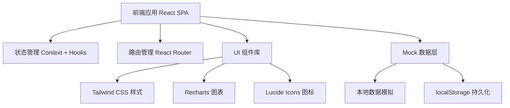
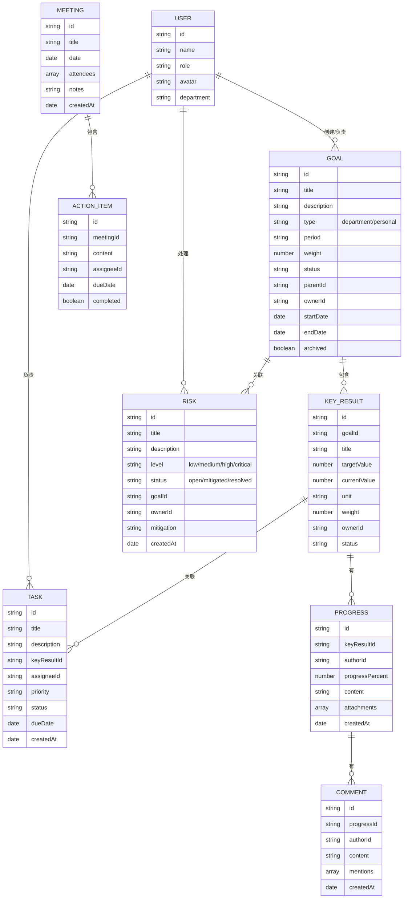

## 1. 架构设计



## 2. 技术描述

- **前端框架**：React 18 + TypeScript
- **构建工具**：Vite 5
- **样式方案**：Tailwind CSS 3
- **路由管理**：React Router v6
- **状态管理**：React Context + useReducer
- **图表库**：Recharts
- **图标库**：Lucide React
- **数据持久化**：localStorage + Mock 数据
- **后端**：无（前端 Mock 数据模拟）

## 3. 路由定义

| 路由路径 | 页面名称 | 用途 |
|----------|----------|------|
| `/` | 仪表盘 | 目标概览、进度统计、待办、动态 |
| `/goals` | 目标树 | 目标层级展示、对齐视图、目标管理 |
| `/tasks` | 任务 | 任务看板、任务列表、任务管理 |
| `/progress` | 进展 | 进展列表、提交进展、评论讨论 |
| `/meetings` | 会议 | 会议列表、会议纪要、行动项 |
| `/risks` | 风险 | 风险看板、风险登记、风险跟踪 |
| `/stats` | 统计 | 数据统计、周报、导出、归档 |

## 4. 数据模型

### 4.1 数据模型定义



### 4.2 数据结构说明

#### 用户 (User)
- id: 唯一标识
- name: 姓名
- role: 角色（manager/member）
- avatar: 头像
- department: 部门

#### 目标 (Goal)
- 支持部门目标和个人目标两种类型
- 支持层级关系（parentId 指向父目标）
- 包含周期、权重、状态等属性
- 支持归档功能

#### 关键结果 (Key Result)
- 隶属于某个目标
- 包含目标值和当前值
- 支持设置权重和负责人
- 完成百分比由 currentValue / targetValue 计算

#### 任务 (Task)
- 关联到关键结果
- 支持优先级、状态、截止日期
- 可分配负责人

#### 进展 (Progress)
- 关键结果的进度更新记录
- 包含完成百分比、进展说明
- 支持上传佐证文件
- 支持评论和 @提及

#### 风险 (Risk)
- 可关联到目标
- 支持四个风险等级
- 跟踪风险处理状态

#### 会议 (Meeting)
- 会议记录包含时间、参会人、纪要
- 包含行动项列表

## 5. 项目目录结构

```
src/
├── components/          # 公共组件
│   ├── Layout/         # 布局组件
│   ├── Card/           # 卡片组件
│   ├── Button/         # 按钮组件
│   ├── Modal/          # 弹窗组件
│   ├── ProgressBar/    # 进度条组件
│   └── Avatar/         # 头像组件
├── pages/              # 页面组件
│   ├── Dashboard/      # 仪表盘
│   ├── Goals/          # 目标树
│   ├── Tasks/          # 任务
│   ├── Progress/       # 进展
│   ├── Meetings/       # 会议
│   ├── Risks/          # 风险
│   └── Stats/          # 统计
├── context/            # 状态管理
│   └── AppContext.tsx
├── data/               # Mock 数据
│   ├── mockData.ts
│   └── seed.ts
├── types/              # TypeScript 类型
│   └── index.ts
├── utils/              # 工具函数
│   ├── helpers.ts
│   └── storage.ts
├── App.tsx
├── main.tsx
└── index.css
```

## 6. 核心技术决策

### 6.1 状态管理
- 使用 React Context + useReducer 进行全局状态管理
- 避免引入 Redux 等重型状态管理库，降低复杂度
- 状态按模块划分，便于维护

### 6.2 样式方案
- 使用 Tailwind CSS 原子化样式
- 自定义主题配置（颜色、字体、间距）
- 响应式设计通过 Tailwind 断点实现

### 6.3 数据持久化
- 使用 localStorage 存储用户操作数据
- 初始数据通过 Mock 生成
- 页面刷新后数据不丢失

### 6.4 图表实现
- 使用 Recharts 图表库
- 支持折线图、柱状图、环形图等多种图表
- 图表数据响应式更新
